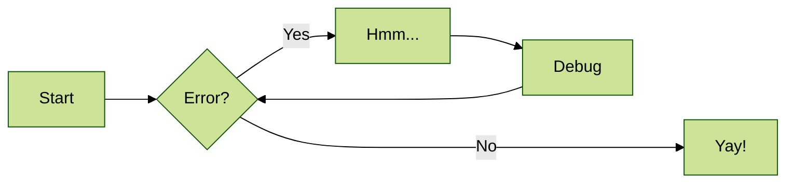

# Index

## Test 1: plantuml

```plantuml
  Alice -> Bob: Hi!
  Bob -> Alice: Hi!
```

## Test 2: mermaid

```mermaid
%%{init: {'theme': 'forest'}}%%
graph LR
  A[Start] --> B{Error?};
  B -->|Yes| C[Hmm...];
  C --> D[Debug];
  D --> B;
  B ---->|No| E[Yay!];
```

```mermaid
graph TD;
    A-->B;
    A-->C;
    B-->D;
    C-->D;
```
